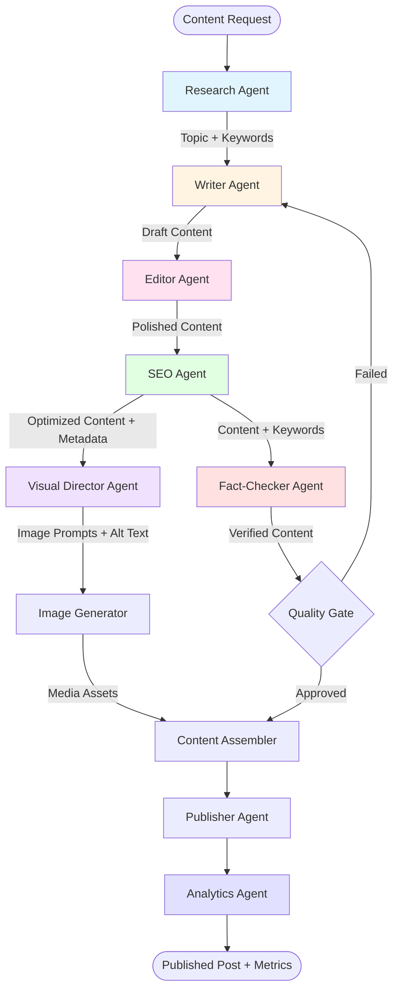
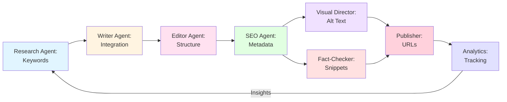
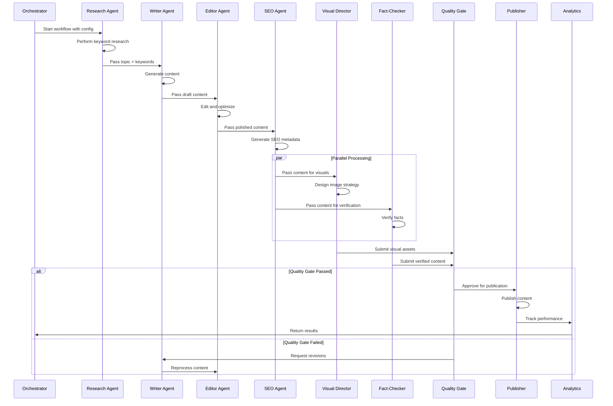
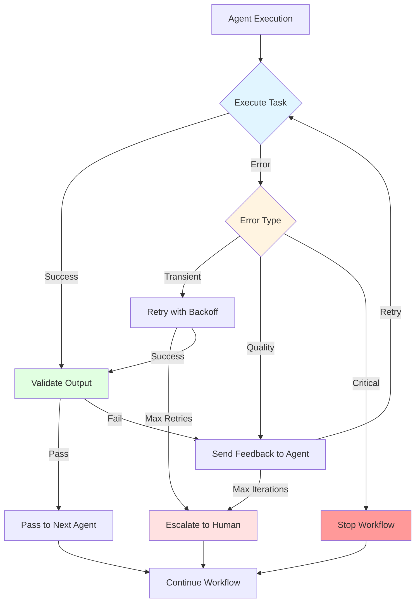
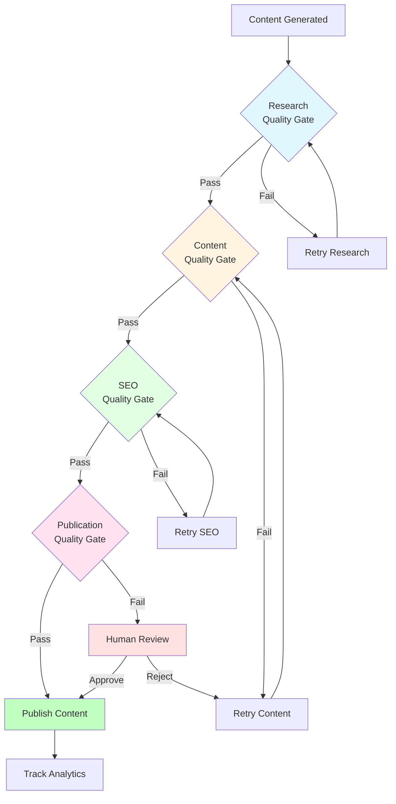
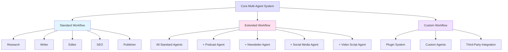
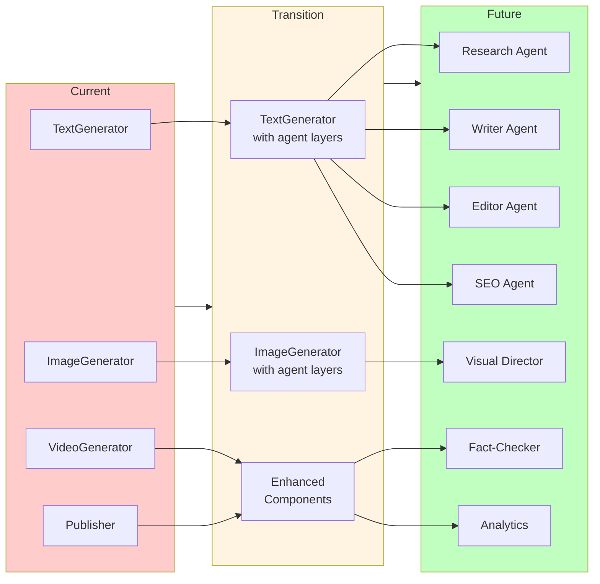
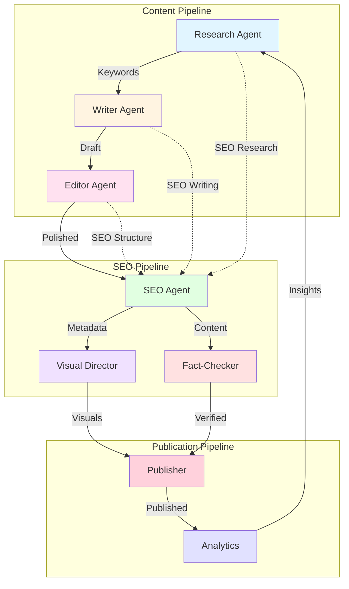
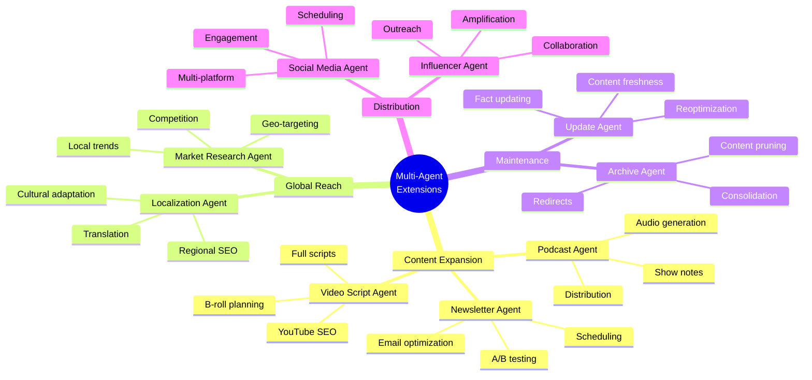
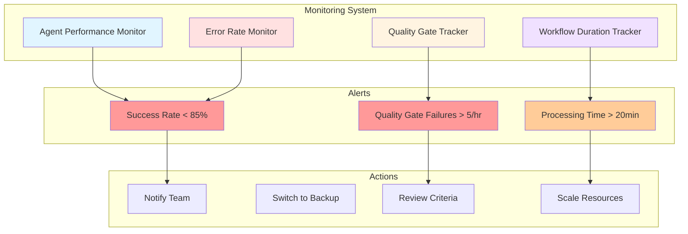

# Multi-Agent System Architecture Diagrams

## Main Workflow Diagram

## SEO Data Flow Diagram

## Agent Communication Pattern

## Error Handling Flow

## Quality Gate System

## Extensibility Architecture

## Migration Path

## Agent Responsibilities Matrix

## Future Extensions

## Performance Monitoring Dashboard

