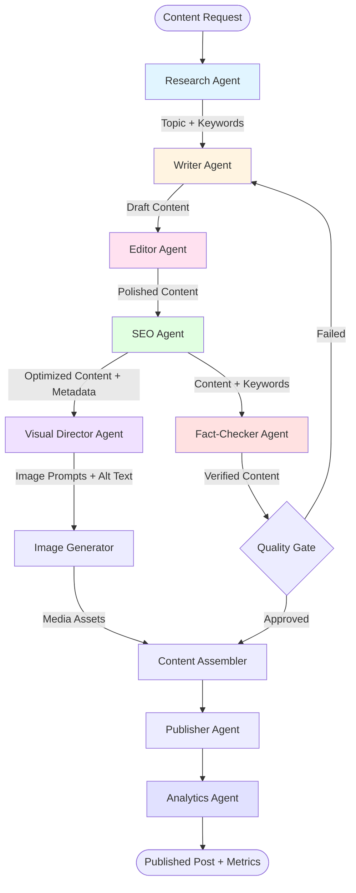
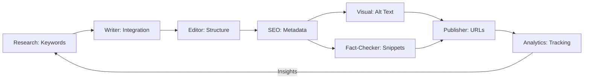

# Multi-Agent Architecture for Substack Auto

## Overview

This document defines a robust multi-agent system architecture for Substack Auto that maximizes content generation efficiency and SEO optimization through specialized agent collaboration. The architecture transitions from a single-agent workflow to a coordinated multi-agent system inspired by CrewAI best practices.

## Table of Contents

1. [System Architecture](#system-architecture)
2. [Agent Definitions](#agent-definitions)
3. [Agent Communication & Handoff](#agent-communication--handoff)
4. [SEO Integration Points](#seo-integration-points)
5. [Data Flow & Context Objects](#data-flow--context-objects)
6. [Error Handling & Quality Gates](#error-handling--quality-gates)
7. [Extensibility](#extensibility)
8. [Implementation Roadmap](#implementation-roadmap)

---

## System Architecture

### Architecture Diagram



### Workflow Stages

**Stage 1: Research & Planning**
- Research Agent discovers trending topics and performs keyword research
- Outputs: Topic recommendation, primary/secondary keywords, search intent

**Stage 2: Content Creation**
- Writer Agent creates long-form content optimized for SEO
- Editor Agent refines content for readability and engagement
- Outputs: Draft content, content structure, key points

**Stage 3: SEO Optimization**
- SEO Agent performs deep optimization, scoring, and metadata generation
- Outputs: Optimized content, meta descriptions, title tags, structured data

**Stage 4: Visual Content & Verification**
- Visual Director Agent designs image prompts with SEO-friendly alt text
- Fact-Checker Agent verifies claims and optimizes for featured snippets
- Outputs: Image prompts, media assets, verified facts

**Stage 5: Publishing & Analytics**
- Publisher Agent assembles and publishes final content
- Analytics Agent tracks performance and provides insights
- Outputs: Published post, performance metrics, optimization recommendations

---

## Agent Definitions

### 1. Research Agent

**Role**: Topic Discovery & SEO Keyword Research

**Responsibilities**:
- Analyze trending topics across configured content areas
- Perform keyword research using SEO best practices
- Identify search intent (informational, transactional, navigational)
- Discover related keywords and semantic variations
- Analyze competitor content and identify gaps
- Recommend optimal content structure based on SERP analysis

**Inputs**:
- Content topics configuration
- Target audience parameters
- Historical performance data

**Outputs**:
```json
{
  "topic": "The Future of AI-Powered Development Tools",
  "primary_keyword": "AI development tools",
  "secondary_keywords": ["AI code assistants", "automated coding", "developer AI"],
  "search_intent": "informational",
  "search_volume": 12000,
  "keyword_difficulty": 45,
  "related_queries": ["best AI coding tools", "AI pair programming"],
  "content_structure": {
    "suggested_headings": ["Introduction to AI Dev Tools", "Top Benefits", "Implementation Guide"],
    "target_word_count": 1500,
    "recommended_media": 3
  },
  "competitor_analysis": {
    "top_ranking_features": ["comprehensive examples", "video demos", "case studies"]
  }
}
```

**SEO Contribution**:
- Ensures content targets high-value, achievable keywords
- Aligns content with user search intent
- Identifies content gaps for competitive advantage

**Integration Points**:
- Maps to: Current `TextGenerator.generate_topic()`
- Future enhancement: Add keyword research APIs (Google Keyword Planner, SEMrush)

---

### 2. Writer Agent

**Role**: Long-Form Content Creation with SEO Focus

**Responsibilities**:
- Generate comprehensive, engaging blog posts based on research
- Incorporate primary and secondary keywords naturally
- Structure content for readability (headings, paragraphs, lists)
- Write compelling introductions and conclusions
- Optimize content length for target keywords
- Include internal linking opportunities
- Apply brand voice and tone guidelines

**Inputs**:
- Research Agent output (keywords, structure, topic)
- Content tone and style settings
- Target audience profile

**Outputs**:
```json
{
  "title": "The Future of AI-Powered Development Tools: A Comprehensive Guide",
  "subtitle": "How AI is revolutionizing software development in 2024",
  "content": "# Introduction\n\nAI development tools are transforming...",
  "word_count": 1542,
  "keyword_density": {
    "AI development tools": 1.2,
    "AI code assistants": 0.8
  },
  "structure": {
    "h1_count": 1,
    "h2_count": 5,
    "h3_count": 8,
    "paragraphs": 23,
    "lists": 4
  },
  "readability_score": 65,
  "internal_link_suggestions": [
    {"anchor": "AI and productivity", "target": "/posts/ai-productivity"}
  ]
}
```

**SEO Contribution**:
- Natural keyword integration throughout content
- Proper heading hierarchy (H1, H2, H3)
- Optimal content length for target keywords
- Internal linking for site architecture

**Integration Points**:
- Maps to: Current `TextGenerator.generate_blog_post()`
- Enhancement: Add keyword density tracking, readability scoring

---

### 3. Editor Agent

**Role**: Content Review, Improvement, and Readability Optimization

**Responsibilities**:
- Review content for grammar, spelling, and style
- Improve readability and flow
- Ensure consistent brand voice
- Optimize sentence structure and paragraph length
- Remove redundancy and improve clarity
- Verify content structure matches SEO recommendations
- Add transition phrases for better flow

**Inputs**:
- Writer Agent output (draft content)
- Brand voice guidelines
- Target readability score

**Outputs**:
```json
{
  "edited_content": "# Introduction\n\nAI development tools are revolutionizing...",
  "changes_summary": {
    "grammar_fixes": 12,
    "clarity_improvements": 8,
    "style_adjustments": 5
  },
  "readability_metrics": {
    "flesch_reading_ease": 68,
    "flesch_kincaid_grade": 8.5,
    "avg_sentence_length": 15,
    "avg_paragraph_length": 3.2
  },
  "improvement_areas": [
    "Simplified complex sentences in introduction",
    "Added transition phrases between sections",
    "Broke up long paragraphs for better scanning"
  ],
  "quality_score": 92
}
```

**SEO Contribution**:
- Improved readability enhances user engagement (dwell time)
- Better structure reduces bounce rate
- Clear, concise content increases shareability

**Integration Points**:
- New capability (not in current system)
- Could integrate readability libraries (textstat, nltk)

---

### 4. SEO Agent

**Role**: Deep SEO Optimization, Scoring, and Metadata Generation

**Responsibilities**:
- Generate SEO-optimized meta descriptions
- Create compelling title tags (within character limits)
- Generate Open Graph and Twitter Card metadata
- Create schema.org structured data (Article, BlogPosting)
- Optimize URL slugs
- Calculate comprehensive SEO score
- Generate XML sitemap entries
- Create canonical URLs
- Suggest related content for internal linking

**Inputs**:
- Editor Agent output (polished content)
- Research Agent keywords
- Publisher configuration

**Outputs**:
```json
{
  "metadata": {
    "title_tag": "The Future of AI-Powered Development Tools | Your Site",
    "meta_description": "Discover how AI development tools are revolutionizing software creation. Learn about top AI code assistants, benefits, and implementation strategies.",
    "canonical_url": "https://yoursite.com/ai-development-tools-future",
    "url_slug": "ai-development-tools-future",
    "focus_keyword": "AI development tools"
  },
  "open_graph": {
    "og:title": "The Future of AI-Powered Development Tools",
    "og:description": "How AI is revolutionizing software development in 2024",
    "og:type": "article",
    "og:image": "/images/ai-dev-tools.jpg",
    "og:url": "https://yoursite.com/ai-development-tools-future"
  },
  "twitter_card": {
    "twitter:card": "summary_large_image",
    "twitter:title": "The Future of AI-Powered Development Tools",
    "twitter:description": "How AI is revolutionizing software development",
    "twitter:image": "/images/ai-dev-tools.jpg"
  },
  "structured_data": {
    "@context": "https://schema.org",
    "@type": "BlogPosting",
    "headline": "The Future of AI-Powered Development Tools",
    "description": "How AI is revolutionizing software development in 2024",
    "author": {
      "@type": "Person",
      "name": "AI Content System"
    },
    "datePublished": "2024-01-15T09:00:00Z",
    "image": "https://yoursite.com/images/ai-dev-tools.jpg",
    "keywords": ["AI development tools", "AI code assistants", "automated coding"]
  },
  "seo_score": {
    "overall": 87,
    "components": {
      "keyword_usage": 90,
      "content_length": 95,
      "readability": 85,
      "meta_optimization": 88,
      "structure": 82,
      "internal_links": 75
    }
  },
  "recommendations": [
    "Consider adding 1-2 more internal links",
    "Meta description could be more action-oriented"
  ]
}
```

**SEO Contribution**:
- Complete metadata for search engine indexing
- Structured data for rich snippets
- Optimized title tags for CTR
- Social media optimization for shareability

**Integration Points**:
- Enhancement to: Current `TextGenerator.generate_tags()`
- Add: Metadata generation, structured data, SEO scoring

---

### 5. Visual Director Agent

**Role**: Image Prompt Design, Media SEO, and Alt-Text Optimization

**Responsibilities**:
- Analyze content to determine optimal image placement
- Design DALL-E prompts that align with content and brand
- Generate SEO-friendly alt text for accessibility and search
- Create image file names optimized for SEO
- Suggest image dimensions and formats
- Plan video thumbnail strategy
- Generate image captions for context

**Inputs**:
- SEO Agent output (optimized content + keywords)
- Brand image style guidelines
- Content structure

**Outputs**:
```json
{
  "image_strategy": {
    "primary_image": {
      "placement": "featured",
      "prompt": "A modern, sleek illustration of AI-powered development tools with code snippets and futuristic interface elements, digital art style, professional tech aesthetic, blue and purple color scheme",
      "alt_text": "AI development tools interface showing code assistance and automated features",
      "file_name": "ai-development-tools-future-guide.png",
      "caption": "Modern AI development tools are transforming how developers write code",
      "dimensions": {"width": 1920, "height": 1080},
      "seo_keywords": ["AI development tools", "code assistance"]
    },
    "supporting_images": [
      {
        "placement": "section_2",
        "prompt": "Developer using AI code assistant, clean workspace, productivity focus",
        "alt_text": "Software developer leveraging AI code assistant for faster development",
        "file_name": "developer-using-ai-assistant.png",
        "caption": "AI assistants help developers write better code faster"
      }
    ]
  },
  "video_thumbnail": {
    "prompt": "Eye-catching thumbnail for AI development tools video, bold text overlay, modern design",
    "alt_text": "Video thumbnail: The Future of AI Development Tools explained",
    "file_name": "ai-dev-tools-video-thumbnail.png"
  },
  "media_seo_score": 85
}
```

**SEO Contribution**:
- Image SEO through optimized alt text and file names
- Improved accessibility (screen readers)
- Enhanced image search visibility
- Rich media for better engagement metrics

**Integration Points**:
- Enhancement to: Current `ImageGenerator.generate_featured_image()`
- Add: Alt text generation, file name optimization, media strategy

---

### 6. Fact-Checker Agent

**Role**: Claim Verification, Statistic Validation, and Snippet Optimization

**Responsibilities**:
- Identify factual claims and statistics in content
- Verify claims against reliable sources
- Add citations and source links
- Optimize content for featured snippets
- Structure Q&A content for "People Also Ask"
- Format lists and tables for snippet-friendly display
- Identify potential misinformation risks

**Inputs**:
- SEO Agent output (optimized content)
- Content with claims and statistics

**Outputs**:
```json
{
  "verification_results": {
    "claims_checked": 15,
    "claims_verified": 14,
    "claims_modified": 1,
    "sources_added": 8
  },
  "citations": [
    {
      "claim": "AI tools can improve developer productivity by 40%",
      "source": "GitHub Developer Survey 2023",
      "url": "https://github.com/developer-survey-2023",
      "verified": true,
      "snippet_optimized": true
    }
  ],
  "snippet_opportunities": [
    {
      "type": "featured_snippet",
      "question": "What are AI development tools?",
      "answer": "AI development tools are software applications that leverage artificial intelligence to assist developers in writing, testing, and debugging code. They include code completion, error detection, and automated refactoring features.",
      "format": "paragraph",
      "optimization_score": 92
    },
    {
      "type": "list_snippet",
      "question": "What are the top 5 benefits of AI development tools?",
      "items": [
        "Increased productivity by up to 40%",
        "Reduced debugging time",
        "Improved code quality",
        "Faster learning curve for new languages",
        "Automated documentation generation"
      ],
      "format": "ordered_list"
    }
  ],
  "fact_check_score": 95,
  "reliability_rating": "high"
}
```

**SEO Contribution**:
- Featured snippet optimization for position zero
- Enhanced credibility through citations
- Structured content for "People Also Ask" boxes
- E-A-T (Expertise, Authoritativeness, Trustworthiness) signals

**Integration Points**:
- New capability (not in current system)
- Could integrate fact-checking APIs, source verification tools

---

### 7. Analytics Agent

**Role**: Performance Tracking and Actionable Insights

**Responsibilities**:
- Track post performance metrics (views, engagement, shares)
- Monitor SEO rankings for target keywords
- Analyze user behavior (scroll depth, time on page, bounce rate)
- Compare performance against historical data
- Generate optimization recommendations
- Identify top-performing content patterns
- Track conversion metrics
- Monitor backlink acquisition

**Inputs**:
- Published post data
- Analytics platform APIs (Google Analytics, Search Console)
- Historical performance data

**Outputs**:
```json
{
  "post_id": "ai-dev-tools-2024",
  "performance_metrics": {
    "views": 1250,
    "unique_visitors": 890,
    "avg_time_on_page": "4:32",
    "bounce_rate": 42,
    "scroll_depth_avg": 78,
    "social_shares": 45,
    "comments": 12,
    "conversions": 23
  },
  "seo_metrics": {
    "keyword_rankings": [
      {"keyword": "AI development tools", "position": 8, "change": "+3"},
      {"keyword": "AI code assistants", "position": 12, "change": "+5"}
    ],
    "organic_traffic": 650,
    "click_through_rate": 3.2,
    "avg_position": 10.5,
    "impressions": 8500,
    "backlinks_gained": 3
  },
  "engagement_analysis": {
    "peak_engagement_time": "09:00-11:00 EST",
    "popular_sections": ["Implementation Guide", "Top Benefits"],
    "exit_points": ["Conclusion section"]
  },
  "recommendations": [
    "Improve conclusion section to reduce exit rate",
    "Consider updating with more code examples (high engagement pattern)",
    "Promote during 9-11 AM for maximum visibility",
    "Target related keyword 'best AI coding tools' (opportunity)"
  ],
  "comparative_analysis": {
    "performance_vs_avg": "+25%",
    "top_performer_category": "technical tutorials"
  },
  "optimization_priority": "medium",
  "next_review_date": "2024-02-15"
}
```

**SEO Contribution**:
- Identifies successful SEO patterns for replication
- Tracks keyword ranking improvements
- Measures organic traffic impact
- Provides data-driven optimization suggestions

**Integration Points**:
- New capability (not in current system)
- Integrate with Google Analytics, Search Console APIs
- Store historical data for trend analysis

---

## Agent Communication & Handoff

### Communication Protocol

Agents communicate through a standardized **Context Object** that accumulates data as it passes through the workflow.

### Context Object Structure

```json
{
  "workflow_id": "wf_20240115_093045",
  "current_stage": "seo_optimization",
  "previous_agent": "editor",
  "next_agent": "visual_director",
  "timestamp": "2024-01-15T09:30:45Z",
  
  "research_data": { },
  "content_draft": { },
  "edited_content": { },
  "seo_metadata": { },
  "visual_strategy": { },
  "fact_check_results": { },
  
  "quality_gates": {
    "research_approved": true,
    "content_approved": true,
    "seo_approved": true,
    "fact_check_approved": true
  },
  
  "errors": [],
  "warnings": [
    "Readability score below target (65 vs 70)"
  ],
  
  "metadata": {
    "content_topics": ["AI", "development", "tools"],
    "target_audience": "developers",
    "brand_voice": "professional and engaging"
  }
}
```

### Handoff Mechanism

**1. Sequential Handoff** (Primary Flow)
- Agent completes task → Updates context object → Passes to next agent
- Each agent validates input before processing
- Context accumulates data throughout pipeline

**2. Parallel Processing** (Where Applicable)
- Visual Director and Fact-Checker can run in parallel after SEO Agent
- Results merged before Quality Gate

**3. Feedback Loops**
- Failed quality gate returns context to appropriate agent
- Agent receives feedback in `errors` or `warnings` fields
- Maximum retry attempts: 3 per agent

### Example Handoff Flow

```python
# Pseudo-code for agent handoff

context = {
    "workflow_id": generate_workflow_id(),
    "metadata": load_configuration()
}

# Stage 1: Research
context = research_agent.execute(context)
if not validate_research(context):
    handle_error(context)
    
# Stage 2: Content Creation
context = writer_agent.execute(context)
context = editor_agent.execute(context)

# Stage 3: SEO Optimization
context = seo_agent.execute(context)

# Stage 4: Parallel Processing
visual_future = visual_director_agent.execute_async(context)
fact_check_future = fact_checker_agent.execute_async(context)

context.update(visual_future.result())
context.update(fact_check_future.result())

# Stage 5: Quality Gate
if quality_gate.validate(context):
    context = publisher_agent.execute(context)
    analytics_agent.track(context)
else:
    retry_with_feedback(context)
```

---

## SEO Integration Points

### Stage-by-Stage SEO Contribution

| Stage | Agent | SEO Activity | Output |
|-------|-------|--------------|--------|
| Research | Research Agent | Keyword research, search intent analysis | Target keywords, search volume, competition |
| Content Creation | Writer Agent | Keyword integration, heading structure | SEO-optimized content structure |
| Editing | Editor Agent | Readability optimization | Improved engagement metrics |
| SEO Optimization | SEO Agent | Metadata, structured data, scoring | Complete SEO package |
| Visual Creation | Visual Director | Alt text, image SEO, file naming | Media SEO optimization |
| Verification | Fact-Checker | Featured snippet optimization, E-A-T | Snippet-ready content, citations |
| Publishing | Publisher Agent | URL structure, canonical tags | SEO-friendly publication |
| Analytics | Analytics Agent | Performance tracking, ranking monitoring | Optimization insights |

### SEO Data Flow



### Key SEO Deliverables by Agent

**Research Agent**:
- Primary & secondary keywords
- Search volume & difficulty
- Competitor analysis
- Content structure recommendations

**Writer Agent**:
- Natural keyword integration (1-2% density)
- Proper heading hierarchy (H1, H2, H3)
- Internal linking opportunities
- Content length optimization

**Editor Agent**:
- Readability score optimization (target: 60-70)
- Engagement-friendly structure
- Clear, scannable content

**SEO Agent**:
- Meta title (50-60 characters)
- Meta description (150-160 characters)
- Open Graph tags
- Schema.org structured data
- XML sitemap entry
- Comprehensive SEO score

**Visual Director Agent**:
- SEO-optimized image file names
- Descriptive, keyword-rich alt text
- Image captions with context
- Optimal image dimensions

**Fact-Checker Agent**:
- Featured snippet optimization
- Q&A formatting for PAA boxes
- Source citations for E-A-T
- Structured lists and tables

**Analytics Agent**:
- Keyword ranking tracking
- Organic traffic monitoring
- CTR analysis
- Conversion tracking
- Optimization recommendations

---

## Data Flow & Context Objects

### Complete Workflow Context Example

```json
{
  "workflow_id": "wf_20240115_093045",
  "created_at": "2024-01-15T09:00:00Z",
  "updated_at": "2024-01-15T09:30:45Z",
  "status": "in_progress",
  "current_stage": "visual_creation",
  
  "configuration": {
    "content_topics": ["AI", "development", "productivity"],
    "target_audience": "professional developers",
    "content_tone": "professional and engaging",
    "content_style": "informative and practical",
    "max_word_count": 2000,
    "target_readability": 70,
    "brand_voice": "authoritative but accessible"
  },
  
  "research": {
    "agent": "research_agent_v1",
    "timestamp": "2024-01-15T09:05:00Z",
    "topic": "The Future of AI-Powered Development Tools",
    "primary_keyword": "AI development tools",
    "secondary_keywords": ["AI code assistants", "automated coding", "developer AI"],
    "search_intent": "informational",
    "search_volume": 12000,
    "keyword_difficulty": 45,
    "competitor_gap": "lack of implementation examples",
    "recommended_structure": {
      "sections": ["Introduction", "Benefits", "Top Tools", "Implementation", "Future Trends"],
      "target_word_count": 1500,
      "suggested_media": 3
    }
  },
  
  "content": {
    "writer_agent": "writer_agent_v1",
    "timestamp": "2024-01-15T09:15:00Z",
    "title": "The Future of AI-Powered Development Tools: A Comprehensive Guide",
    "subtitle": "How AI is revolutionizing software development in 2024",
    "content": "# Introduction\n\nArtificial intelligence is fundamentally transforming...",
    "word_count": 1542,
    "keyword_usage": {
      "AI development tools": 18,
      "AI code assistants": 12,
      "automated coding": 8
    },
    "structure": {
      "headings": {
        "h1": 1,
        "h2": 5,
        "h3": 8
      },
      "paragraphs": 23,
      "lists": 4,
      "code_blocks": 3
    }
  },
  
  "editing": {
    "editor_agent": "editor_agent_v1",
    "timestamp": "2024-01-15T09:20:00Z",
    "changes_made": 25,
    "improvements": [
      "Simplified technical jargon in introduction",
      "Added transition phrases between sections",
      "Broke long paragraphs into shorter ones",
      "Improved call-to-action clarity"
    ],
    "readability": {
      "flesch_reading_ease": 68,
      "flesch_kincaid_grade": 8.5,
      "avg_sentence_length": 15.2,
      "avg_paragraph_length": 3.1
    },
    "quality_score": 92
  },
  
  "seo": {
    "seo_agent": "seo_agent_v1",
    "timestamp": "2024-01-15T09:25:00Z",
    "metadata": {
      "title_tag": "The Future of AI-Powered Development Tools | DevTech Blog",
      "meta_description": "Discover how AI development tools are revolutionizing software creation. Learn about top AI code assistants, benefits, and implementation strategies for 2024.",
      "url_slug": "ai-development-tools-future-guide",
      "canonical_url": "https://devtech.blog/ai-development-tools-future-guide"
    },
    "open_graph": {
      "og:title": "The Future of AI-Powered Development Tools",
      "og:description": "How AI is revolutionizing software development in 2024",
      "og:type": "article",
      "og:image": "https://devtech.blog/images/ai-dev-tools-featured.jpg"
    },
    "structured_data": {
      "@context": "https://schema.org",
      "@type": "BlogPosting",
      "headline": "The Future of AI-Powered Development Tools",
      "author": {"@type": "Organization", "name": "DevTech Blog"},
      "datePublished": "2024-01-15T09:00:00Z",
      "keywords": ["AI development tools", "AI code assistants", "automated coding"]
    },
    "seo_score": {
      "overall": 87,
      "keyword_optimization": 90,
      "content_quality": 92,
      "technical_seo": 85,
      "user_experience": 82
    }
  },
  
  "visual": {
    "visual_director_agent": "visual_director_v1",
    "timestamp": "2024-01-15T09:28:00Z",
    "images": [
      {
        "type": "featured",
        "prompt": "Modern illustration of AI-powered development tools with code and futuristic elements, digital art, professional tech aesthetic",
        "alt_text": "AI development tools interface showing code assistance and automated features",
        "file_name": "ai-development-tools-future-guide.png",
        "dimensions": {"width": 1920, "height": 1080}
      }
    ],
    "video_thumbnail": {
      "prompt": "Eye-catching thumbnail with bold text 'AI Dev Tools 2024'",
      "alt_text": "Video thumbnail: The Future of AI Development Tools explained"
    }
  },
  
  "fact_check": {
    "fact_checker_agent": "fact_checker_v1",
    "timestamp": "2024-01-15T09:30:00Z",
    "claims_verified": 14,
    "sources_added": 8,
    "snippet_opportunities": 3,
    "citations": [
      {
        "claim": "AI tools improve productivity by 40%",
        "source": "GitHub Developer Survey 2023",
        "url": "https://github.com/survey"
      }
    ],
    "reliability_score": 95
  },
  
  "quality_gates": {
    "research_approved": true,
    "content_quality_approved": true,
    "seo_approved": true,
    "fact_check_approved": true,
    "ready_for_publication": true
  },
  
  "errors": [],
  "warnings": [
    "Consider adding more code examples for technical audience"
  ],
  
  "performance_predictions": {
    "estimated_ranking": "top 15",
    "estimated_traffic": "500-800 monthly views",
    "confidence": 0.75
  }
}
```

### Minimal Context Object (Handoff Between Agents)

```json
{
  "workflow_id": "wf_20240115_093045",
  "current_agent": "editor",
  "next_agent": "seo",
  "timestamp": "2024-01-15T09:20:00Z",
  
  "content": {
    "title": "...",
    "content": "...",
    "word_count": 1542
  },
  
  "research_context": {
    "primary_keyword": "AI development tools",
    "target_audience": "professional developers"
  },
  
  "validation": {
    "passed": true,
    "score": 92
  }
}
```

---

## Error Handling & Quality Gates

### Quality Gate System

Quality gates are checkpoints that validate content before proceeding to the next stage. Failed gates trigger retry logic or human review.

#### Quality Gate Definitions

**1. Research Quality Gate**
```json
{
  "gate_name": "research_validation",
  "criteria": {
    "has_primary_keyword": true,
    "search_volume": ">1000",
    "keyword_difficulty": "<60",
    "has_content_structure": true
  },
  "threshold": "all_criteria",
  "on_failure": "retry_research"
}
```

**2. Content Quality Gate**
```json
{
  "gate_name": "content_validation",
  "criteria": {
    "min_word_count": 800,
    "max_word_count": 3000,
    "keyword_density": "0.5-2.5%",
    "readability_score": ">60",
    "heading_structure": "valid",
    "has_introduction": true,
    "has_conclusion": true
  },
  "threshold": 0.85,
  "on_failure": "feedback_to_writer"
}
```

**3. SEO Quality Gate**
```json
{
  "gate_name": "seo_validation",
  "criteria": {
    "meta_title_length": "50-60",
    "meta_description_length": "150-160",
    "has_structured_data": true,
    "has_og_tags": true,
    "seo_score": ">80",
    "has_canonical_url": true
  },
  "threshold": "all_criteria",
  "on_failure": "retry_seo_optimization"
}
```

**4. Publication Quality Gate**
```json
{
  "gate_name": "publication_validation",
  "criteria": {
    "all_previous_gates_passed": true,
    "has_featured_image": true,
    "has_alt_text": true,
    "fact_check_score": ">90",
    "no_critical_errors": true
  },
  "threshold": "all_criteria",
  "on_failure": "hold_for_review"
}
```

### Error Handling Strategy

#### Error Categories

**1. Transient Errors** (Retry with exponential backoff)
- API rate limits
- Network timeouts
- Temporary service unavailability

```python
retry_config = {
    "max_attempts": 3,
    "initial_delay": 1,  # seconds
    "multiplier": 2,
    "max_delay": 30
}
```

**2. Content Quality Errors** (Feedback loop)
- Low quality score
- Failed readability check
- Keyword density issues
- Missing required sections

```python
feedback_loop = {
    "max_iterations": 3,
    "feedback_format": "structured_json",
    "escalate_after": 3  # Escalate to human review
}
```

**3. Validation Errors** (Agent-specific handling)
- Invalid keyword selection
- Missing metadata
- Broken source citations
- Invalid image prompts

**4. Critical Errors** (Stop workflow)
- Configuration errors
- Authentication failures
- Data corruption
- Service unavailable

#### Error Response Example

```json
{
  "error": {
    "type": "content_quality",
    "severity": "medium",
    "agent": "writer_agent",
    "timestamp": "2024-01-15T09:15:00Z",
    "message": "Content readability score below threshold",
    "details": {
      "current_score": 55,
      "required_score": 60,
      "issues": [
        "Average sentence length too high (22 words)",
        "Too many complex words (15%)"
      ]
    },
    "suggested_action": "simplify_language",
    "retry_count": 1,
    "max_retries": 3
  },
  "feedback_for_agent": {
    "instructions": "Simplify language and shorten sentences",
    "focus_areas": ["sentence_length", "word_complexity"],
    "examples": [
      "Instead of: 'The utilization of AI development tools...'",
      "Try: 'Using AI development tools...'"
    ]
  }
}
```

### Fallback Mechanisms

**1. Degraded Operation Mode**
- If advanced features fail, fall back to simpler alternatives
- Example: If DALL-E fails, use stock images or simple graphics

**2. Human-in-the-Loop**
- Critical failures escalate to human review
- Dashboard for reviewing flagged content
- Manual approval workflow

**3. Content Quarantine**
- Failed content stored in quarantine
- Can be reviewed, edited, and reprocessed
- Never published without passing all gates

**4. Alternative Agent Selection**
- If primary agent fails repeatedly, switch to backup
- Different models or approaches

### Monitoring & Alerting

```json
{
  "monitoring": {
    "success_rate": {
      "alert_threshold": 0.85,
      "action": "notify_team"
    },
    "average_processing_time": {
      "warning_threshold": 600,
      "alert_threshold": 1200,
      "action": "investigate_bottleneck"
    },
    "quality_gate_failures": {
      "alert_threshold": 5,
      "action": "review_quality_criteria"
    }
  }
}
```

---

## Extensibility

The multi-agent architecture is designed for easy extension with new agents and capabilities.

### Future Agent Additions

#### 1. Podcast Agent

**Role**: Convert written content to podcast episodes

**Inputs**:
- Published blog post content
- Voice style preferences

**Outputs**:
- Audio script optimized for speaking
- Generated audio file (text-to-speech)
- Show notes with timestamps
- Podcast metadata (title, description, tags)

**Integration Point**: After Publisher Agent, parallel with Analytics

**SEO Contribution**:
- Podcast SEO (Apple Podcasts, Spotify)
- Show notes for searchability
- Transcripts for content indexing

#### 2. Newsletter Agent

**Role**: Create newsletter versions of blog content

**Inputs**:
- Published blog post
- Subscriber list segments
- Email marketing platform API

**Outputs**:
- Email-optimized content (shorter, punchier)
- Subject line variations (A/B test ready)
- Preview text
- Call-to-action buttons
- Newsletter schedule

**Integration Point**: After Publisher Agent, parallel with Analytics

**SEO Contribution**:
- Drives direct traffic to blog
- Increases engagement metrics
- Builds backlink opportunities through shares

#### 3. Social Media Agent

**Role**: Generate platform-specific social media content

**Inputs**:
- Published blog post
- Social media platform (Twitter, LinkedIn, Facebook)
- Brand social voice

**Outputs**:
- Platform-optimized posts (character limits, hashtags)
- Thread structures (Twitter)
- Multiple post variations for scheduling
- Optimal posting times
- Hashtag recommendations

**Integration Point**: After Publisher Agent

**SEO Contribution**:
- Social signals for SEO
- Traffic generation
- Brand awareness
- Social proof (shares, engagement)

#### 4. Video Script Agent

**Role**: Create full video scripts from blog content

**Inputs**:
- Published blog post
- Video style (tutorial, explainer, talking head)
- Target duration

**Outputs**:
- Full video script with timing
- B-roll suggestions
- On-screen text recommendations
- Shot list
- Video SEO metadata

**Integration Point**: Parallel with Visual Director Agent

**SEO Contribution**:
- YouTube SEO
- Video rich snippets
- Embedded video engagement
- Multi-format content strategy

#### 5. Localization Agent

**Role**: Translate and localize content for different markets

**Inputs**:
- Published blog post
- Target languages/locales
- Cultural considerations

**Outputs**:
- Translated content
- Localized SEO keywords
- Cultural adaptations
- Region-specific metadata

**Integration Point**: After Publisher Agent

**SEO Contribution**:
- International SEO
- Multi-language targeting
- Geographic expansion
- Hreflang tags

#### 6. Update & Refresh Agent

**Role**: Monitor and update existing content for freshness

**Inputs**:
- Published content inventory
- Performance metrics
- Industry news and trends

**Outputs**:
- Content update recommendations
- Refreshed sections
- New statistics and facts
- Updated SEO metadata
- Content pruning suggestions

**Integration Point**: Continuous background process

**SEO Contribution**:
- Content freshness signals
- Improved rankings for existing content
- Reduced content decay
- Evergreen content maintenance

### Adding a New Agent - Template

```python
from typing import Dict, Any
from agents.base_agent import BaseAgent

class NewAgent(BaseAgent):
    """
    Agent description and role.
    """
    
    def __init__(self, config: Dict[str, Any]):
        super().__init__(config)
        self.agent_name = "new_agent"
        self.version = "v1"
        
    def validate_input(self, context: Dict[str, Any]) -> bool:
        """
        Validate that the context contains required information.
        """
        required_fields = ["field1", "field2"]
        return all(field in context for field in required_fields)
    
    def execute(self, context: Dict[str, Any]) -> Dict[str, Any]:
        """
        Main execution logic.
        
        Args:
            context: Current workflow context
            
        Returns:
            Updated context with agent outputs
        """
        # Validate input
        if not self.validate_input(context):
            raise ValueError("Invalid input context")
        
        # Execute agent logic
        result = self._process(context)
        
        # Update context
        context["new_agent_output"] = result
        context["current_agent"] = self.agent_name
        context["timestamp"] = self._get_timestamp()
        
        return context
    
    def _process(self, context: Dict[str, Any]) -> Dict[str, Any]:
        """
        Internal processing logic.
        """
        # Implementation here
        pass
    
    def get_seo_contribution(self) -> Dict[str, str]:
        """
        Describe SEO impact of this agent.
        """
        return {
            "category": "seo_category",
            "impact": "description of SEO impact",
            "metrics": ["metric1", "metric2"]
        }
```

### Extension Points in Architecture

**1. Agent Registry**
```python
agent_registry = {
    "research": ResearchAgent,
    "writer": WriterAgent,
    "editor": EditorAgent,
    "seo": SEOAgent,
    "visual_director": VisualDirectorAgent,
    "fact_checker": FactCheckerAgent,
    "analytics": AnalyticsAgent,
    # Easy to add new agents
    "podcast": PodcastAgent,
    "newsletter": NewsletterAgent,
}
```

**2. Workflow Configuration**
```yaml
# workflow_config.yaml
workflows:
  standard_blog:
    agents: [research, writer, editor, seo, visual_director, fact_checker, publisher, analytics]
  
  full_multimedia:
    agents: [research, writer, editor, seo, visual_director, fact_checker, video_script, publisher, analytics, podcast, social_media]
  
  international:
    agents: [research, writer, editor, seo, visual_director, fact_checker, publisher, localization, analytics]
```

**3. Plugin System**
```python
# Plugin interface for third-party extensions
class AgentPlugin:
    def register(self, orchestrator):
        """Register plugin with orchestrator"""
        pass
    
    def get_agent(self):
        """Return agent implementation"""
        pass
    
    def get_dependencies(self):
        """List required dependencies"""
        pass
```

---

## Implementation Roadmap

### Phase 1: Foundation (Weeks 1-2)
- [ ] Implement base agent interface and communication protocol
- [ ] Create context object structure and validation
- [ ] Set up agent registry and orchestrator
- [ ] Implement basic error handling and retry logic

### Phase 2: Core Agents (Weeks 3-6)
- [ ] Implement Research Agent
- [ ] Implement Writer Agent (enhance existing TextGenerator)
- [ ] Implement Editor Agent
- [ ] Implement SEO Agent
- [ ] Add quality gates for each agent

### Phase 3: Media & Verification (Weeks 7-9)
- [ ] Implement Visual Director Agent (enhance ImageGenerator)
- [ ] Implement Fact-Checker Agent
- [ ] Enhance VideoGenerator integration
- [ ] Add media SEO optimization

### Phase 4: Publishing & Analytics (Weeks 10-12)
- [ ] Enhance Publisher Agent with full SEO metadata
- [ ] Implement Analytics Agent
- [ ] Set up performance tracking
- [ ] Create analytics dashboard

### Phase 5: Testing & Optimization (Weeks 13-14)
- [ ] Comprehensive integration testing
- [ ] Performance optimization
- [ ] Quality gate tuning
- [ ] Documentation completion

### Phase 6: Extensions (Weeks 15-16)
- [ ] Implement Newsletter Agent
- [ ] Implement Social Media Agent
- [ ] Set up plugin system
- [ ] Community documentation

### Migration Strategy from Current System

**Current Architecture**:
```
ContentOrchestrator → TextGenerator → ImageGenerator → VideoGenerator → Publisher
```

**Transition Architecture** (Backward Compatible):
```
ContentOrchestrator
  ├─ TextGenerator (becomes Writer + Editor + SEO agents internally)
  ├─ ImageGenerator (becomes Visual Director agent internally)
  ├─ VideoGenerator (enhanced with media SEO)
  └─ Publisher (enhanced with metadata support)
```

**Final Architecture**:
```
MultiAgentOrchestrator
  ├─ Research Agent
  ├─ Writer Agent
  ├─ Editor Agent
  ├─ SEO Agent
  ├─ Visual Director Agent
  ├─ Fact-Checker Agent
  ├─ Publisher Agent
  └─ Analytics Agent
```

### Backward Compatibility

During migration, maintain compatibility with existing code:

```python
# Legacy interface (still works)
orchestrator = ContentOrchestrator()
result = orchestrator.create_and_publish_post()

# New interface (multi-agent)
orchestrator = MultiAgentOrchestrator()
result = orchestrator.execute_workflow("standard_blog")
```

---

## References

- [CrewAI Examples](https://github.com/crewAIInc/crewAI-examples)
- [CrewAI Content Production Flow](https://github.com/crewAIInc/crewAI/blob/main/docs/en/guides/concepts/evaluating-use-cases.mdx)
- [Project README](https://github.com/becominggiantcollective/substack_auto/blob/main/README.md)
- [Google Search Quality Guidelines](https://developers.google.com/search/docs)
- [Schema.org Structured Data](https://schema.org/BlogPosting)

---

## Appendix: SEO Best Practices Summary

### On-Page SEO Checklist
- ✅ Keyword research and selection (Research Agent)
- ✅ Natural keyword integration (Writer Agent)
- ✅ Optimized title tags and meta descriptions (SEO Agent)
- ✅ Proper heading hierarchy (Writer + Editor Agents)
- ✅ Alt text for all images (Visual Director Agent)
- ✅ Internal linking strategy (Writer Agent)
- ✅ Readable, engaging content (Editor Agent)
- ✅ Structured data markup (SEO Agent)
- ✅ Mobile-friendly formatting (Publisher Agent)
- ✅ Fast page load times (Publisher Agent)

### Content SEO Checklist
- ✅ Comprehensive, in-depth content (Writer Agent)
- ✅ Answer user search intent (Research Agent)
- ✅ Featured snippet optimization (Fact-Checker Agent)
- ✅ E-A-T signals (citations, sources) (Fact-Checker Agent)
- ✅ Fresh, up-to-date information (Research Agent)
- ✅ Engaging multimedia (Visual Director Agent)
- ✅ Clear call-to-action (Writer Agent)

### Technical SEO Checklist
- ✅ Clean URL structure (SEO Agent)
- ✅ Canonical URLs (SEO Agent)
- ✅ XML sitemap (SEO Agent)
- ✅ Schema markup (SEO Agent)
- ✅ Open Graph tags (SEO Agent)
- ✅ Twitter Cards (SEO Agent)

### Performance Tracking
- ✅ Keyword rankings (Analytics Agent)
- ✅ Organic traffic (Analytics Agent)
- ✅ User engagement metrics (Analytics Agent)
- ✅ Conversion tracking (Analytics Agent)
- ✅ Backlink monitoring (Analytics Agent)

---

**Document Version**: 1.0  
**Last Updated**: 2024-01-15  
**Status**: Ready for Team Review  
**Next Review**: After Phase 1 Implementation
